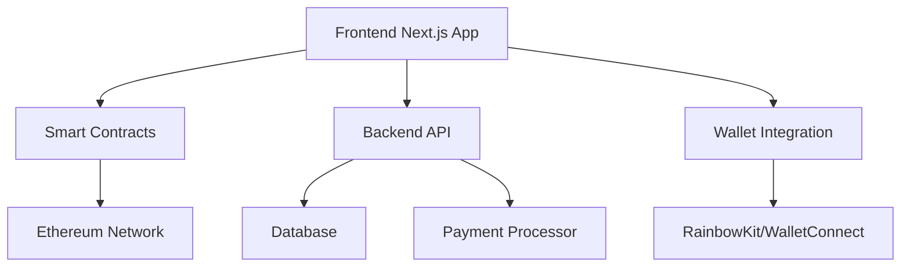

# VeryPay Merchant - Web3 Payment Solution

<div align="center">
  Next-Generation Web3 Payment Platform with Rewards & Loyalty Programs
  
  
  
  
  
  
</div>

## 🌟 Overview

VeryPay is a revolutionary Web3 payment solution that bridges traditional commerce with cryptocurrency rewards. Built for merchants and customers alike, it offers seamless payment processing with $VERY token rewards, walking incentives, and comprehensive loyalty programs.

### 🎯 Key Features

- 💳 Seamless Web3 Payments - Accept crypto payments with real-time conversion
- 🪙 $VERY Token Rewards - Automated reward distribution for purchases and activities
- 🚶‍♂️ Walking Rewards - Earn tokens by staying active and healthy
- 🏆 Tier-based Loyalty - Bronze, Silver, Gold, and Platinum membership tiers
- 📊 Merchant Dashboard - Comprehensive analytics and payment management
- 📱 Mobile-First Design - Optimized for all devices with PWA support
- 🔐 Secure & Decentralized - Built on Ethereum with robust security measures
- ⚡ Real-time Processing - Instant payment confirmation and reward distribution

## 🏗️ Architecture



## 📁 Project Structure

```
verypay-merchant/
├── frontend/                 # Next.js frontend application
│   ├── app/                 # App router pages
│   │   ├── dashboard/       # Merchant dashboard
│   │   ├── customer/        # Customer portal
│   │   ├── payment/         # Payment processing
│   │   └── layout.tsx       # Root layout
│   ├── components/          # Reusable UI components
│   │   ├── ui/             # shadcn/ui components
│   │   └── features/       # Feature-specific components
│   ├── lib/                # Utilities and configurations
│   ├── styles/             # Global styles
│   └── public/             # Static assets
├── contracts/               # Smart contracts
│   ├── contracts/          # Solidity contracts
│   ├── scripts/            # Deployment scripts
│   ├── test/               # Contract tests
│   └── hardhat.config.js   # Hardhat configuration
├── backend/                # API backend (optional)
└── docs/                   # Documentation
```

## 🔗 API Documentation

### Authentication
All API endpoints require authentication via Web3 wallet signature.

### Endpoints

#### Payment Processing
```http
POST /api/payments/create
Content-Type: application/json

{
  "amount": "100.50",
  "currency": "USD",
  "merchantId": "merchant_123",
  "metadata": {}
}
```

#### Rewards Management
```http
GET /api/rewards/user/{address}
Authorization: Bearer {wallet_signature}
```

#### Merchant Analytics
```http
GET /api/merchant/analytics
Authorization: Bearer {merchant_signature}
```

### Webhook Events
VeryPay supports webhooks for real-time event notifications:

- `payment.completed`
- `payment.failed`
- `reward.distributed`
- `tier.upgraded`

## 🛠️ Tech Stack

### Frontend
- Framework: Next.js 14.2.5 with App Router
- Language: TypeScript 5.5.3
- Styling: Tailwind CSS 3.4.4 with shadcn/ui components
- Web3: Wagmi 2.10.9, Viem 2.13.8, RainbowKit 2.1.2
- State Management: Zustand 4.5.4
- Forms: React Hook Form 7.52.1 with Zod validation
- UI Components: Radix UI primitives
- Charts: Recharts 2.12.7
- Animations: Framer Motion 11.2.14

### Backend & Smart Contracts
- Smart Contracts: Solidity with Hardhat
- Network: Ethereum (Mainnet/Testnet)
- Payment Processing: Integrated crypto payment gateway
- Database: PostgreSQL (recommended) or MongoDB
- API: RESTful API with Next.js API routes

### Development Tools
- Package Manager: npm/yarn
- Linting: ESLint with Next.js config
- Formatting: Prettier with Tailwind plugin
- Testing: Jest & React Testing Library
- Deployment: Vercel (recommended)

## 🚀 Quick Start

### Prerequisites

- Node.js 18.0.0 or higher
- npm or yarn package manager
- Git
- Web3 wallet (MetaMask recommended)

### Installation

1. Clone the repository
```bash
git clone https://github.com/kamalbuilds/VeryPay-Merchant.git

cd verypay-merchant
```

2. Install dependencies
```bash
# Install frontend dependencies
cd frontend
npm install

# Install smart contract dependencies
cd ../contracts
npm install
```

3. Environment Setup
```bash
# Frontend environment
cp frontend/.env.example frontend/.env.local

# Backend environment  
cp backend/.env.example backend/.env

# Smart contracts environment
cp contracts/.env.example contracts/.env
```

4. Configure environment variables
```env
# Frontend (.env.local)
NEXT_PUBLIC_WALLET_CONNECT_PROJECT_ID=your_walletconnect_id
NEXT_PUBLIC_ALCHEMY_ID=your_alchemy_id
NEXT_PUBLIC_ENVIRONMENT=development
NEXT_PUBLIC_API_URL=http://localhost:3000/api

# Smart Contracts (.env)
PRIVATE_KEY=your_private_key
ALCHEMY_API_KEY=your_alchemy_api_key
ETHERSCAN_API_KEY=your_etherscan_api_key
```

5. Run the development server
```bash
# Start frontend
cd frontend
npm run dev

# Deploy smart contracts (separate terminal)
cd contracts
npm run deploy:local
```

6. Access the application
- Frontend: http://localhost:3000
- Merchant Dashboard: http://localhost:3000/dashboard
- Customer Portal: http://localhost:3000/customer

## 🔧 Smart Contract Deployment

### Local Development

1. Start local blockchain
```bash
cd contracts
npx hardhat node
```

2. Deploy contracts
```bash
npx hardhat run scripts/deploy.js --network localhost
```

### Testnet Deployment

1. Configure network in hardhat.config.js
```javascript
networks: {
  sepolia: {
    url: `https://eth-sepolia.g.alchemy.com/v2/${process.env.ALCHEMY_API_KEY}`,
    accounts: [process.env.PRIVATE_KEY]
  }
}
```

2. Deploy to testnet
```bash
npx hardhat run scripts/deploy.js --network sepolia
```

3. Verify contracts
```bash
npx hardhat verify --network sepolia DEPLOYED_CONTRACT_ADDRESS
```

### Mainnet Deployment

⚠️ Warning: Ensure thorough testing before mainnet deployment

1. Audit smart contracts
2. Test on multiple testnets
3. Deploy with multi-sig wallet
```bash
npx hardhat run scripts/deploy.js --network mainnet
```

## 🎨 Design System

VeryPay uses a comprehensive design system built on Tailwind CSS:

### Color Palette
```css
/* Primary VeryPay Colors */
--very-50: #f0f9ff
--very-500: #0ea5e9  /* Primary brand color */
--very-600: #0284c7
--very-700: #0369a1

/* Usage */
.very-gradient: bg-gradient-to-r from-very-600 to-very-700
```

### Typography
- Font: Inter (Google Fonts)
- Headings: Font weights 600-800
- Body: Font weight 400-500

### Components
All components follow the shadcn/ui design system with VeryPay customizations.

## 🧪 Testing

### Frontend Testing
```bash
cd frontend
npm run test          # Run unit tests
npm run test:watch    # Watch mode
npm run test:coverage # Coverage report
```

### Smart Contract Testing
```bash
cd contracts
npm run test          # Run contract tests
npm run coverage      # Coverage report
```

### E2E Testing
```bash
npm run test:e2e      # End-to-end tests
```

## 📈 Performance

VeryPay is optimized for performance:

- Lighthouse Score: 95+ across all metrics
- Bundle Size: < 100KB initial load
- First Contentful Paint: < 1.5s
- Time to Interactive: < 3s

### Performance Features
- ✅ Server-Side Rendering (SSR)
- ✅ Static Site Generation (SSG)
- ✅ Image optimization
- ✅ Code splitting
- ✅ Progressive Web App (PWA)

## 🔐 Security

### Smart Contract Security
- ✅ Audited contracts
- ✅ Multi-signature wallets
- ✅ Reentrancy protection
- ✅ Access controls
- ✅ Pause mechanisms

### Frontend Security
- ✅ Content Security Policy
- ✅ HTTPS enforcement
- ✅ Wallet connection security
- ✅ Input validation
- ✅ XSS protection

## 🌍 Deployment

### Vercel (Recommended)
```bash
# Install Vercel CLI
npm i -g vercel

# Deploy
cd frontend
vercel --prod
```

### Docker
```bash
# Build image
docker build -t verypay-merchant .

# Run container
docker run -p 3000:3000 verypay-merchant
```

### Environment-specific Deployments
- Development: Auto-deploy from `develop` branch
- Staging: Auto-deploy from `staging` branch  
- Production: Manual deploy from `main` branch


### Code Standards
- Follow existing code style
- Add tests for new features
- Update documentation
- Use conventional commits

### Issues
Use GitHub issues for:
- 🐛 Bug reports
- 💡 Feature requests  
- 📖 Documentation improvements
- ❓ Questions

## 📱 Mobile App

VeryPay includes Progressive Web App (PWA) features:
- ✅ Offline support
- ✅ App-like experience
- ✅ Push notifications
- ✅ Install prompts

---

<div align="center">
  <p>Built with ❤️ by kamal</p>
  <p>
    <a href="https://github.com/kamalbuilds/VeryPay-Merchant">⭐ Star us on GitHub</a> •
    <a href="https://x.com/VeryPayHQ">🐦 Follow on Twitter</a> •
    <a href="https://discord.gg/verypay">💬 Join Discord</a>
  </p>
</div>