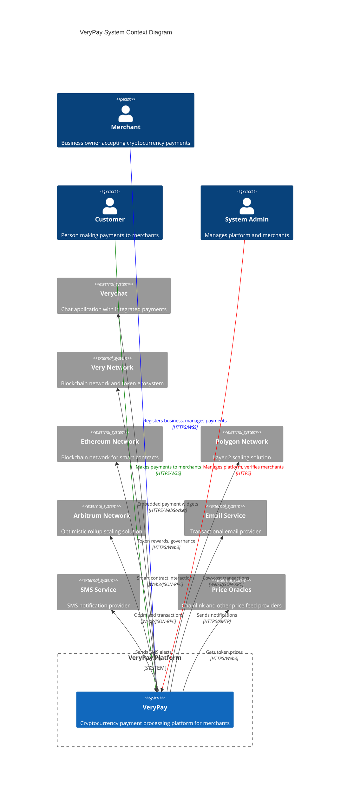
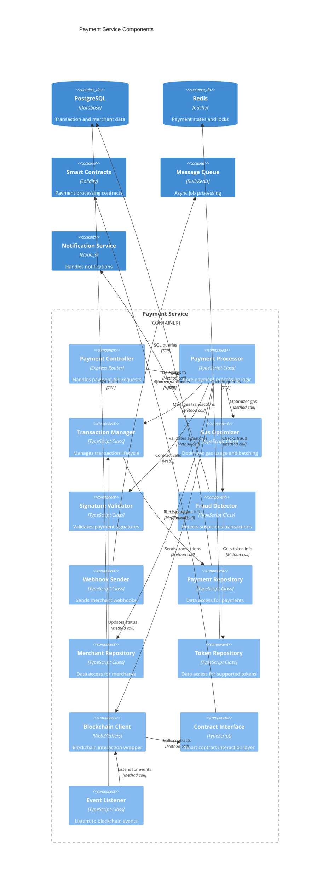
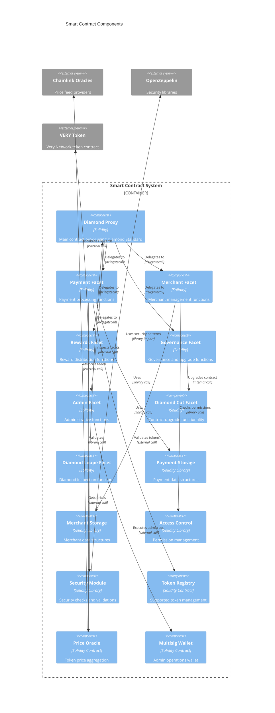
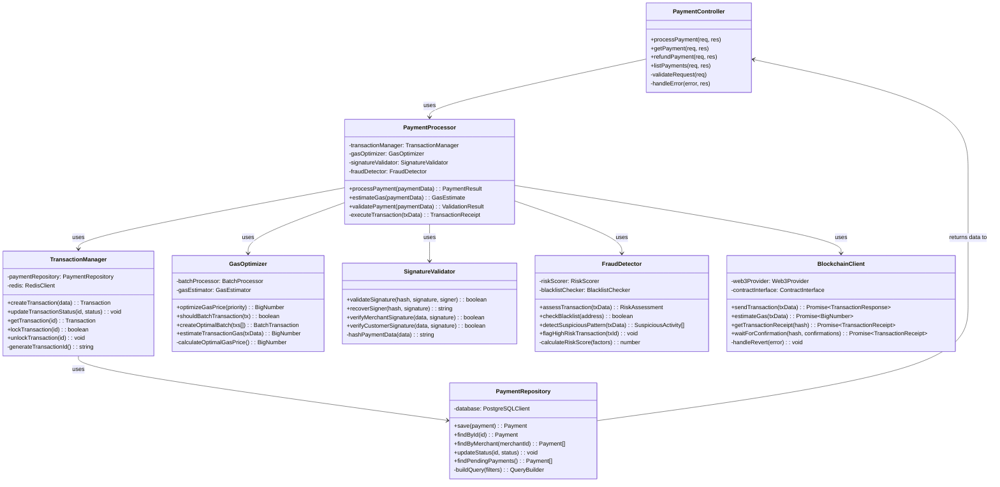
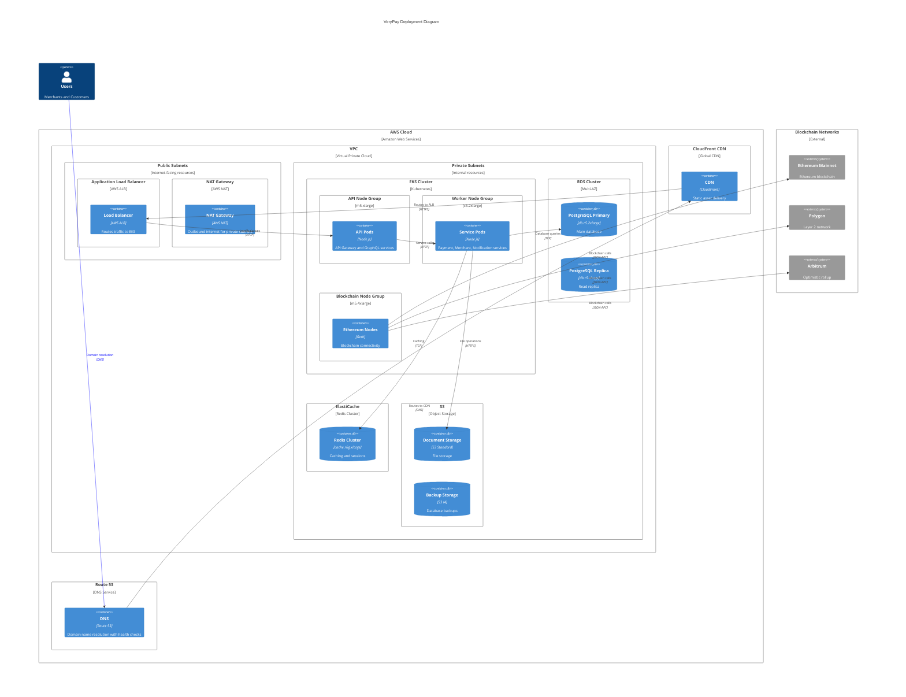

# VeryPay C4 Model Architecture Diagrams

## 1. C4 Model Overview

The C4 model provides a hierarchical approach to software architecture documentation through four levels of abstraction: Context, Containers, Components, and Code. This document presents VeryPay's architecture using this methodology.

## 2. Level 1: System Context Diagram

## 3. Level 2: Container Diagram

```mermaid
C4Container
    title VeryPay Container Diagram
    
    Person(merchant, "Merchant", "Business owner")
    Person(customer, "Customer", "Payment maker")
    Person(admin, "Admin", "Platform manager")
    
    System_Boundary(verypay, "VeryPay Platform") {
        Container(web_app, "Web Application", "React/TypeScript", "Merchant dashboard and payment interfaces")
        Container(mobile_app, "Mobile App", "React Native", "Mobile payment interface")
        Container(widget, "Payment Widget", "JavaScript", "Embeddable payment widget for websites")
        
        Container(api_gateway, "API Gateway", "Node.js/Express", "Routes requests, handles authentication")
        Container(graphql_api, "GraphQL API", "Node.js/Apollo", "Flexible query interface for clients")
        
        Container(payment_service, "Payment Service", "Node.js/TypeScript", "Processes cryptocurrency payments")
        Container(merchant_service, "Merchant Service", "Node.js/TypeScript", "Manages merchant profiles and onboarding")
        Container(notification_service, "Notification Service", "Node.js/TypeScript", "Handles email, SMS, and push notifications")
        Container(analytics_service, "Analytics Service", "Node.js/TypeScript", "Processes transaction analytics")
        Container(reward_service, "Reward Service", "Node.js/TypeScript", "Calculates and distributes rewards")
        
        Container(smart_contracts, "Smart Contracts", "Solidity", "Payment processing and merchant management")
        Container(blockchain_indexer, "Blockchain Indexer", "Node.js/TypeScript", "Indexes blockchain events and transactions")
        
        ContainerDb(postgres, "PostgreSQL Database", "PostgreSQL", "Stores merchant data, transactions, users")
        ContainerDb(redis, "Redis Cache", "Redis", "Caching, sessions, real-time data")
        ContainerDb(mongodb, "MongoDB", "MongoDB", "Analytics data and event logs")
        ContainerDb(s3, "S3 Storage", "AWS S3", "Document storage, backups")
        
        Container(message_queue, "Message Queue", "Redis/Bull", "Asynchronous job processing")
        Container(websocket, "WebSocket Server", "Socket.io", "Real-time updates to clients")
    }
    
    System_Ext(blockchain, "Blockchain Networks", "Ethereum, Polygon, Arbitrum")
    System_Ext(very_ecosystem, "Very Ecosystem", "Verychat, Very Network")
    System_Ext(external_services, "External Services", "Email, SMS, Price Oracles")
    
    Rel(merchant, web_app, "Uses", "HTTPS")
    Rel(customer, mobile_app, "Uses", "HTTPS")
    Rel(customer, widget, "Interacts", "HTTPS")
    
    Rel(web_app, api_gateway, "API calls", "HTTPS/REST")
    Rel(mobile_app, graphql_api, "GraphQL queries", "HTTPS/GraphQL")
    Rel(widget, api_gateway, "Payment requests", "HTTPS/REST")
    
    Rel(api_gateway, payment_service, "Routes requests", "HTTP")
    Rel(api_gateway, merchant_service, "Routes requests", "HTTP")
    Rel(graphql_api, payment_service, "Data queries", "HTTP")
    Rel(graphql_api, merchant_service, "Data queries", "HTTP")
    
    Rel(payment_service, smart_contracts, "Contract calls", "Web3")
    Rel(payment_service, postgres, "Stores data", "TCP")
    Rel(payment_service, redis, "Caches data", "TCP")
    Rel(payment_service, message_queue, "Queues jobs", "TCP")
    
    Rel(merchant_service, postgres, "Stores data", "TCP")
    Rel(merchant_service, s3, "Stores documents", "HTTPS")
    
    Rel(notification_service, external_services, "Sends notifications", "HTTPS")
    Rel(analytics_service, mongodb, "Stores analytics", "TCP")
    Rel(reward_service, smart_contracts, "Distributes rewards", "Web3")
    
    Rel(blockchain_indexer, blockchain, "Monitors events", "Web3")
    Rel(blockchain_indexer, postgres, "Updates data", "TCP")
    
    Rel(websocket, redis, "Pub/Sub", "TCP")
    Rel(web_app, websocket, "Real-time updates", "WebSocket")
    
    UpdateRelStyle(merchant, web_app, $textColor="blue", $lineColor="blue")
    UpdateRelStyle(customer, mobile_app, $textColor="green", $lineColor="green")
```

## 4. Level 3: Component Diagram - Payment Service

## 5. Level 3: Component Diagram - Smart Contracts

## 6. Level 4: Code Diagram - Payment Processing

## 7. Deployment Diagram

## 8. Architecture Decision Records (ADRs) Visualization

```mermaid
graph TD
    A[ADR-001: Diamond Standard] --> B[Upgradeable Contracts]
    A --> C[Gas Efficiency]
    A --> D[Modularity]
    
    E[ADR-002: Multi-Chain Strategy] --> F[Ethereum Mainnet]
    E --> G[Polygon Layer 2]
    E --> H[Arbitrum Rollup]
    
    I[ADR-003: Microservices Architecture] --> J[Payment Service]
    I --> K[Merchant Service]
    I --> L[Notification Service]
    
    M[ADR-004: PostgreSQL + Redis] --> N[ACID Compliance]
    M --> O[High Performance]
    M --> P[Caching Strategy]
    
    Q[ADR-005: Kubernetes Deployment] --> R[Container Orchestration]
    Q --> S[Auto-scaling]
    Q --> T[High Availability]
    
    style A fill:#e1f5fe
    style E fill:#f3e5f5
    style I fill:#e8f5e8
    style M fill:#fff3e0
    style Q fill:#fce4ec
```

This C4 model documentation provides a comprehensive view of VeryPay's architecture at multiple levels of detail, making it easy for stakeholders to understand the system structure and make informed decisions about development and deployment.